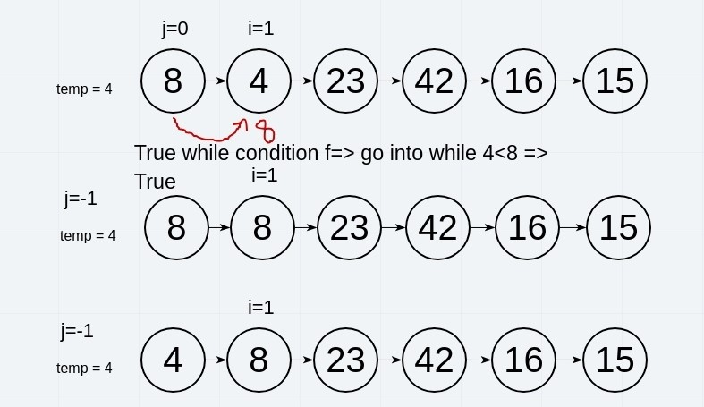
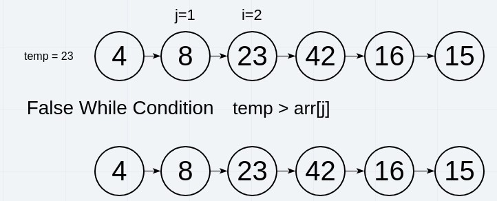
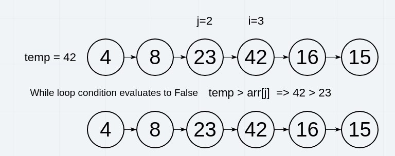
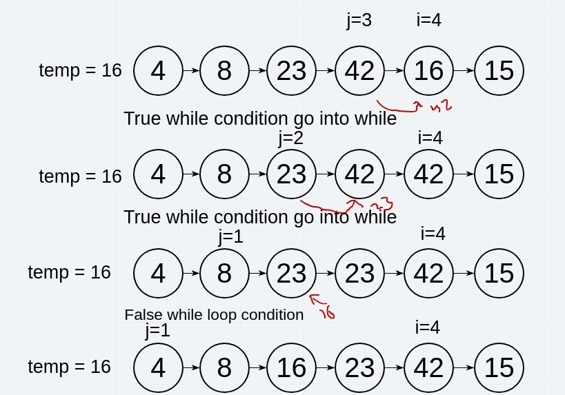
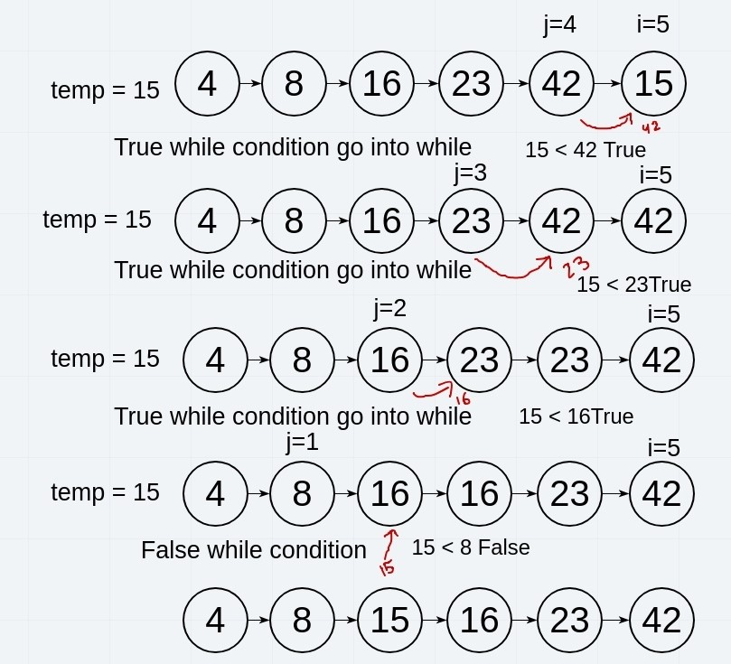

# Insertion Sort

Insertion sort is a simple sorting algorithm. The array is virtually split into a sorted and an unsorted part. Values from the unsorted part are picked and placed at the correct position in the sorted part.

## Algorithm

To sort an array of size n in ascending order:

1. Iterate from arr[1] to arr[n] over the array.
2. Compare the current element (key) to its predecessor.
3. If the key element is smaller than its predecessor, compare it to the elements before. Move the greater elements one position up to make space for the swapped element.

```Pseudocode

  InsertionSort(int[] arr)
  
    FOR i = 1 to arr.length
    
      int j <-- i - 1
      int temp <-- arr[i]
      
      WHILE j >= 0 AND temp < arr[j]
        arr[j + 1] <-- arr[j]
        j <-- j - 1
        
      arr[j + 1] <-- temp

```

## Trace

Sample Array: [8,4,23,42,16,15].

### Iteration 1:

We begin with i = 1 and j = 0. The while loop will evaluate to true and the inside statements will be executed. The second element will be cahnged to 8 and then the while will end because it will evaluate to false after that. Now the first element will be set to temp which is 4 in this caase. The first element will be sorted now and the first iteration ends.



### Iteration 2:

In the second iteration, i will be 2 and j will be 1. The while loop will evaluate to false. Nothing happens and the second iteration will be terminated.



### Iteration 3:

In the third iteration, i will be 3 and j will be 2. The while loop will evaluate to false. Nothing happens and the iteration will be terminated.



### Iteration 4:

The forth iteration, i will be 4 and j will be 3. The while loop will evaluate to true and the statements inside while will be executed two times since when we change the third element to the previous element value. Then the while will evaluate to true again. After the second looping, the condition will fail and the value of the element next to j will be set to the value of temp which is 16. Here the element will be sorted and the iteration will end.



### Iteration 5:

The fifth iteration, i will be 5 and j will be 4. The while loop will evaluate to true and the statements inside while will be executed three times since when we change the forth element to the previous element value. Then the while will evaluate to true again. The while statments will be executed again. And one last time the while condition evaluates to true. After the third looping, the conditon will fail and the value of the element next to j will be set to the value of temp which is 15. Here the element will be sorted and the iteration will end.



Here, we have exhausted all elements in the array. The for loop will end and the whole function will terminate resulting in the sorted array.

## Efficiency:

- Time: O(n^2)
The basic operation of this algorithm is comparison. This will happen n * (n-1) number of times…concluding the algorithm to be n squared.
- Space: O(1)
No additional space is being created. This array is being sorted in place…keeping the space at constant O(1).
