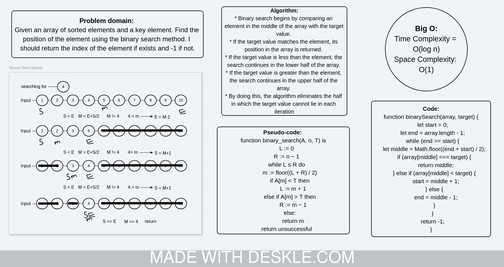

# Challenge Summary
<!-- Short summary or background information -->
Write a function called binarySearchArray that takes and arraty of sorted element and a target.Return the index of the target element, -1 otherwise.

## Challenge Description
<!-- Description of the challenge -->
Given an array of sorted elements and a key element. Find the position of the element using the binary search method. I should return the index of the element if exists and -1 if not.

## Approach & Efficiency
<!-- What approach did you take? Why? What is the Big O space/time for this approach? -->

* Binary search begins by comparing an element in the middle of the array with the target value.

* If the target value matches the element, its position in the array is returned.

* If the target value is less than the element, the search continues in the lower half of the array.

* If the target value is greater than the element, the search continues in the upper half of the array.

* By doing this, the algorithm eliminates the half in which the target value cannot lie in each iteration

## Solution
<!-- Embedded whiteboard image -->

