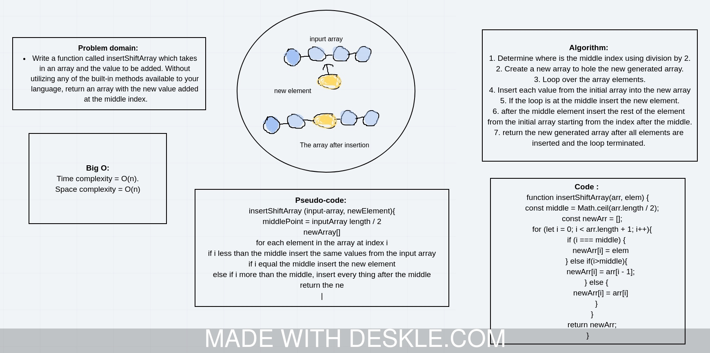

# Challenge Summary
<!-- Short summary or background information -->
Afunction that insert new elemnt at the middle of the array and shift the rest of the elements.

## Challenge Description
<!-- Description of the challenge -->
Write a function called insertShiftArray which takes in an array and the value to be added. Without utilizing any of the built-in methods available to your language, return an array with the new value added at the middle index.

## Approach & Efficiency
<!-- What approach did you take? Why? What is the Big O space/time for this approach? -->
I used for loop to loop over elements from the original array. When the loop is at the middle insert the new element then continue noramlly with the rest of the original items until all are exhausted.

Time complexity = O(n).
Space complexity = O(n).

## Solution
<!-- Embedded whiteboard image -->

[insert and shift array file](array-shift.js)
