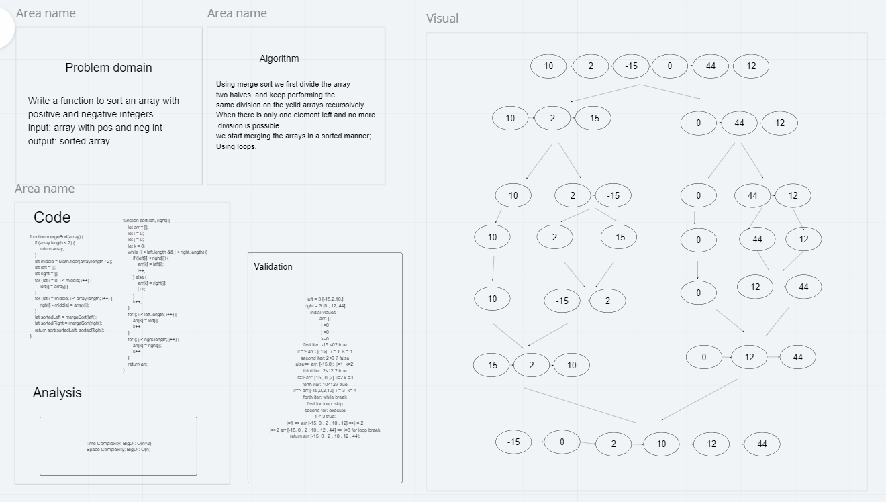

# Challenge Summary
<!-- Description of the challenge -->
Merge sort is built off the idea of comparing whole arrays instead of individual items. First, we need to take the entire array and break it into many sub-arrays by continuously splitting everything in half until everything is alone in its own array. Since the amount of sub-arrays will be some multiple of the number of items in our main array, that’s what gives us the log in O(n log n).

## Whiteboard Process
<!-- Embedded whiteboard image -->


## Approach & Efficiency
<!-- What approach did you take? Why? What is the Big O space/time for this approach? -->
Merge sort is a divide and conquer algorithm. The goal being to break down our problem into sub-problems and recursively continue to break those down until we have a lot of simple problems that we can easily put back together.

```pseudo-code

ALGORITHM Mergesort(arr)
    DECLARE n <-- arr.length
           
    if n > 1
      DECLARE mid <-- n/2
      DECLARE left <-- arr[0...mid]
      DECLARE right <-- arr[mid...n]
      // sort the left side
      Mergesort(left)
      // sort the right side
      Mergesort(right)
      // merge the sorted left and right sides together
      Merge(left, right, arr)

ALGORITHM Merge(left, right, arr)
    DECLARE i <-- 0
    DECLARE j <-- 0
    DECLARE k <-- 0

    while i < left.length && j < right.length
        if left[i] <= right[j]
            arr[k] <-- left[i]
            i <-- i + 1
        else
            arr[k] <-- right[j]
            j <-- j + 1
            
        k <-- k + 1

    if i = left.length
       set remaining entries in arr to remaining values in right
    else
       set remaining entries in arr to remaining values in left

```

## Solution
<!-- Show how to run your code, and examples of it in action -->
### Merge

To simplify our problem we can start by creating a utility function that’ll merge two sorted arrays. There are many different ways of doing this but I found this the most succinct.

As long as there are items in either array, check if the first item in either array is smaller, then throw it into sorted and remove that item from the array with shift(). When that’s done, if there’s anything leftover, like when one array is larger, concatenate that onto the end.

So both arrays are gradually shrinking until one of them is empty with the leftovers thrown onto the end, since it’s already sorted.

```javascript

const merge = (arr1, arr2) => {
  let sorted = [];

  while (arr1.length && arr2.length) {
    if (arr1[0] < arr2[0]) sorted.push(arr1.shift());
    else sorted.push(arr2.shift());
  };

  return sorted.concat(arr1.slice().concat(arr2.slice()));
};

```

### Sorting

This is the easy part, we can use a recursive function to continuously cut our array in half, using slice() to save the data on either side of the center. It’ll return when we have our 1 item arrays then we’ll use our merge utility to start building them back into one large array, with every merge sorting them along the way.

```javascript

const mergeSort = arr => {
  if (arr.length <= 1) return arr;
  let mid = Math.floor(arr.length / 2),
      left = mergeSort(arr.slice(0, mid)),
      right = mergeSort(arr.slice(mid));

  return merge(left, right);
};

console.log(mergeSort(unsortedArr));

```
