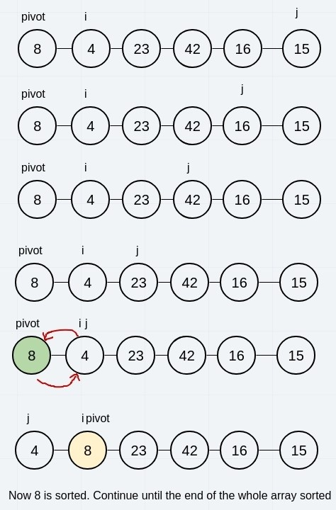
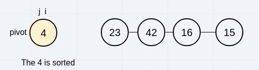
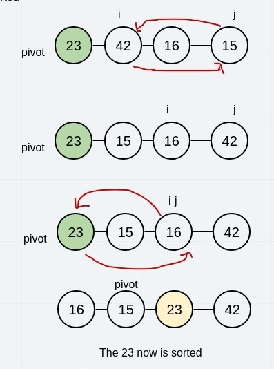
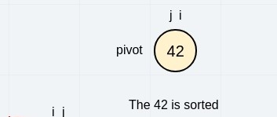
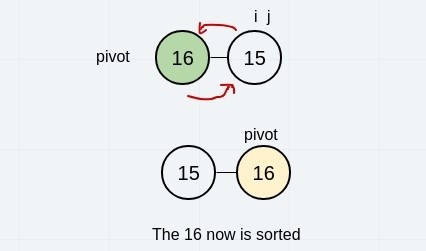
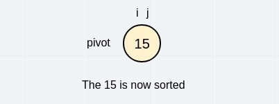
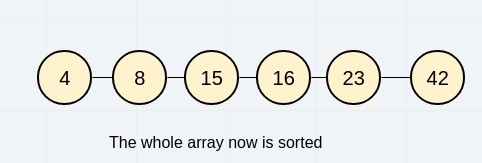

# Quick Sort

## Description

Quick sort is one of the famous sorting algorithms. The algorithm is good to sort different kinds of data structures. In this blog post we will discover how the algorithm works in action throughout sorting an example array.

## Algorithm

Quick sort takes a pivot which is one of the elements in the array. Then, we take two pointers one from the beginning of the array after the pivot, and one from the end of the array. Then we move on from the left side until we reach a number that is begging than the pivot and stop. We also move to the right pointer toward the left side one element at a time until we reach a number less than the pivot so we stop. If the index of the left pointer is still less than the index of the right pointer, we swap the two elements and continue doing this step until we reach a time where we have the right pointer is less than the left pointer. Here we swap the pivot with the right pointer after it becomes less than the left pointer. Now we will have the pivot sorted out and we repeat the whole steps on the left and the right sides of the array starting from before and after the index of the sorted previous pivot. In the end we will have the whole array sorted.

```Pseudocode

ALGORITHM QuickSort(arr, left, right)
    if left < right
        // Partition the array by setting the position of the pivot value 
        DEFINE position <-- Partition(arr, left, right)
        // Sort the left
        QuickSort(arr, left, position - 1)
        // Sort the right
        QuickSort(arr, position + 1, right)

ALGORITHM Partition(arr, left, right)
    // set a pivot value as a point of reference
    DEFINE pivot <-- arr[right]
    // create a variable to track the largest index of numbers lower than the defined pivot
    DEFINE low <-- left - 1
    for i <- left to right do
        if arr[i] <= pivot
            low++
            Swap(arr, i, low)

     // place the value of the pivot location in the middle.
     // all numbers smaller than the pivot are on the left, larger on the right. 
     Swap(arr, right, low + 1)
    // return the pivot index point
     return low + 1

ALGORITHM Swap(arr, i, low)
    DEFINE temp;
    temp <-- arr[i]
    arr[i] <-- arr[low]
    arr[low] <-- temp

```

## Trace

Sample Array: [8,4,23,42,16,15].

### Phase 1:

We start with the pivot from the leftmost element. We iterate from the left looking for element that is larger than the pivot. So we find the 23 and we stop. We start moving from the rightmost looking for element less than the pivot. We do not find until we reach the 4. Because the index of the right pointer now is less than the left pointer index. We end the loop. Then we swap the pivot with the element at the right index (j) and we return that index. Now, the 8 is sorted. Which means all element at the left of 8 now is lesser and all elements at its right are greater.



### Phase 2:

We then perform the same thing on the elements to the left of the last sorted element. Which in this case is only number 4. So we found it is sorted and do nothing.



### Phase 3:

Next, we take the right side of the rest of the array. Starting from 23 as pivot. We find that the first element at the left pointer is larger than the pivot so we stop. Also from the right side we find that 15 at the right pointer is less than the pivot so we stop. We notice now that the left pointer index is still less than the right one. So we swap the two items. Then we continue from the left. Now the element at the next index is less than the pivot, so we stop. Continuing from the right, we move until we reach 16 which is the same index of the left. We stop and swap the pivot with the element at the right pointer. And now 23 is sorted



### Phase 4:

The right side of the last sorted element is only a single element. So it will be already sorted.



### Phase 5:

Taking the left side of the last pivot, we get the pivot 16 and swab between it and the remaining element which is the 15.



### Phase 6:

The lst element is the 15. Since it is the last element it will be already sorted and we finish the while process.



Here, we have exhausted all elements in the array. The for loop will end and the whole function will terminate resulting in the sorted array.



## Efficiency:

- Time: O(n^2)
The basic operation of this algorithm is comparison. This will happen n * (n-1) number of times…concluding the algorithm to be n squared.
- Space: O(1)
No additional space is being created. This array is being sorted in place…keeping the space at constant O(1).
