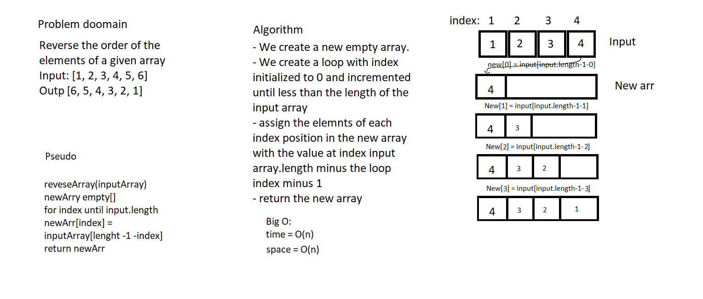

# Reverse an Array
<!-- Short summary or background information -->
Givin an input array of any type, reverse the element order.

## Challenge
<!-- Description of the challenge -->
when this array input [1, 2, 3, 4, 5, 6]  to become [6, 5, 4, 3, 2, 1]

## Approach & Efficiency
<!-- What approach did you take? Why? What is the Big O space/time for this approach? -->
Space : O(n).
Time : O(n).

## Solution
<!-- Embedded whiteboard image -->

[Reverse array file](reverse-arrays.js)
