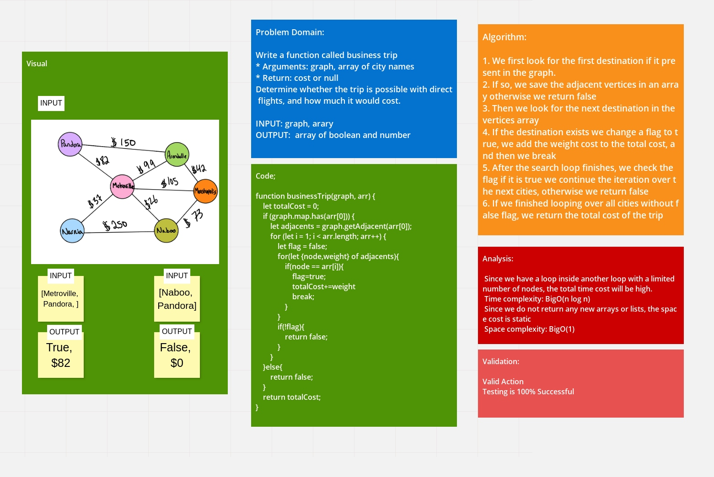

# Challenge Summary
<!-- Description of the challenge -->
Write a function called business trip

* Arguments: graph, array of city names
* Return: cost or null

Determine whether the trip is possible with direct flights, and how much it would cost.

## Whiteboard Process
<!-- Embedded whiteboard image -->

## Approach & Efficiency
<!-- What approach did you take? Why? What is the Big O space/time for this approach? -->
 Since we have a loop inside another loop with a limited number of nodes, the total time cost will be high.
 Time complexity: BigO(n log n)
 Since we do not return any new arrays or lists, the space cost is static
 Space complexity: BigO(1)

## Solution
<!-- Show how to run your code, and examples of it in action -->
1. We first look for the first destination if it present in the graph.
2. If so, we save the adjacent vertices in an array otherwise we return false
3. Then we look for the next destination in the vertices array
4. If the destination exists we change a flag to true, we add the weight cost to the total cost, and then we break
5. After the search loop finishes, we check the flag if it is true we continue the iteration over the next cities, otherwise we return false
6. If we finished looping over all cities without false flag, we return the total cost of the trip