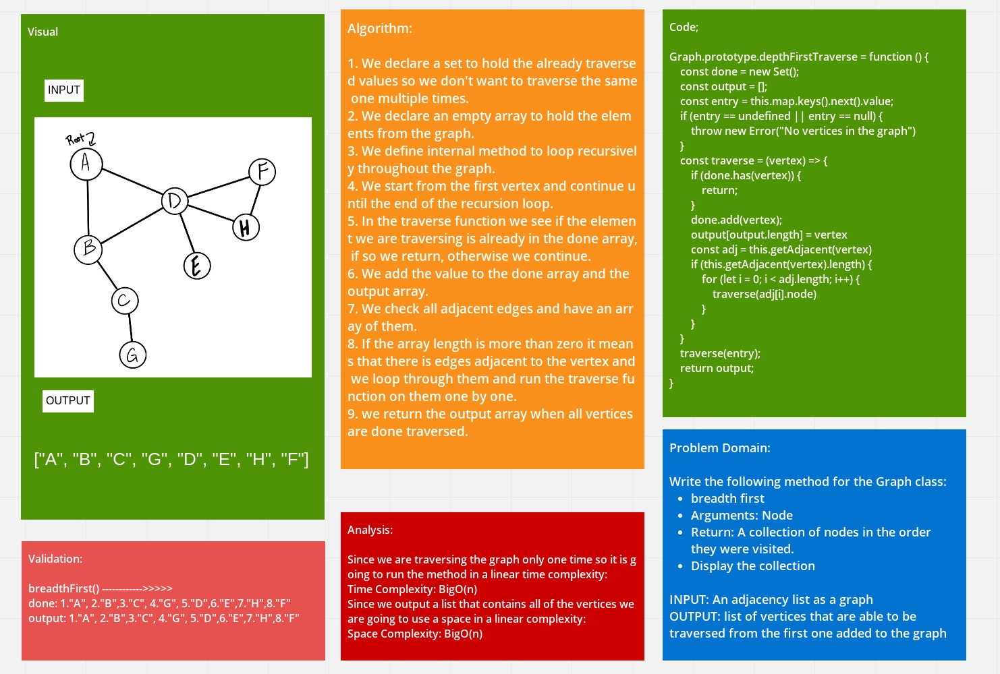

# Challenge Summary
<!-- Description of the challenge -->
Write a method for the Graph class:

* depth first
* Arguments: An adjacency list as a graph
* Return: A collection of nodes in their pre-order depth-first traversal order
* Display the collection

## Whiteboard Process
<!-- Embedded whiteboard image -->

## Approach & Efficiency
<!-- What approach did you take? Why? What is the Big O space/time for this approach? -->
Since we are traversing the graph only one time so it is going to run the method in a linear time complexity: 
Time Complexity: BigO(n)
Since we output a list that contains all of the vertices we are going to use a space in a linear complexity:
Space Complexity: BigO(n)

## Solution
<!-- Show how to run your code, and examples of it in action -->
1. We declare a set to hold the already traversed values so we don't want to traverse the same one multiple times.
2. We declare an empty array to hold the elements from the graph.
3. We define internal method to loop recursively throughout the graph.
4. We start from the first vertex and continue until the end of the recursion loop.
5. In the traverse function we see if the element we are traversing is already in the done array, if so we return, otherwise we continue.
6. We add the value to the done array and the output array.
7. We check all adjacent edges and have an array of them.
8. If the array length is more than zero it means that there is edges adjacent to the vertex and we loop through them and run the traverse function on them one by one.
9. we return the output array when all vertices are done traversed.