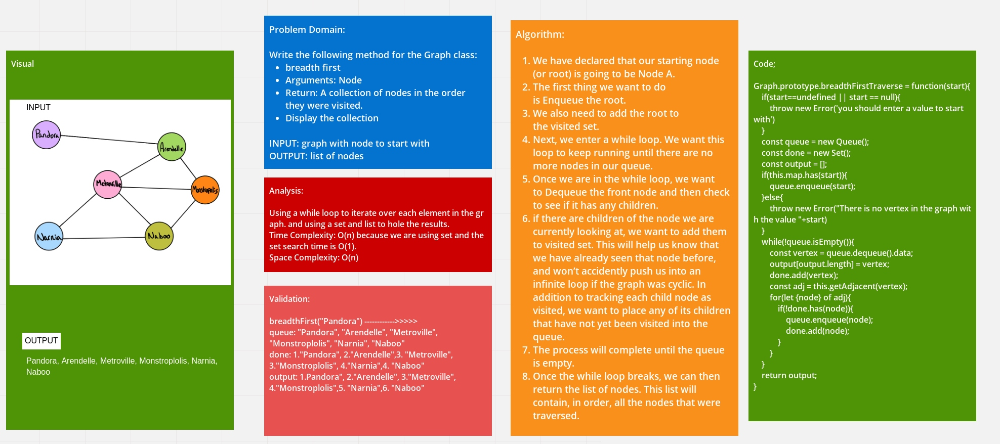

# Challenge Summary
<!-- Description of the challenge -->
Write the following method for the Graph class:

* breadth first
* Arguments: Node
* Return: A collection of nodes in the order they were visited.
* Display the collection

## Whiteboard Process
<!-- Embedded whiteboard image -->


## Approach & Efficiency
<!-- What approach did you take? Why? What is the Big O space/time for this approach? -->
Using a while loop to iterate over each element in the graph. and using a set and list to hole the results.
Time Complexity: O(n) because we are using set and the set search time is O(1).
Space Complexity: O(n)

## Solution
<!-- Show how to run your code, and examples of it in action -->
1. Enqueue the declared start node into the Queue.
2. Create a loop that will run while the node still has nodes present.
3. Dequeue the first node from the queue
4. if the Dequeue‘d node has unvisited child nodes, add the unvisited children to visited set and insert them into the queue.

```javascript

ALGORITHM BreadthFirst(vertex)
    DECLARE nodes <-- new List()
    DECLARE breadth <-- new Queue()
    DECLARE visited <-- new Set()

    breadth.Enqueue(vertex)
    visited.Add(vertex)

    while (breadth is not empty)
        DECLARE front <-- breadth.Dequeue()
        nodes.Add(front)

        for each child in front.Children
            if(child is not visited)
                visited.Add(child)
                breadth.Enqueue(child)   

    return nodes;

```
