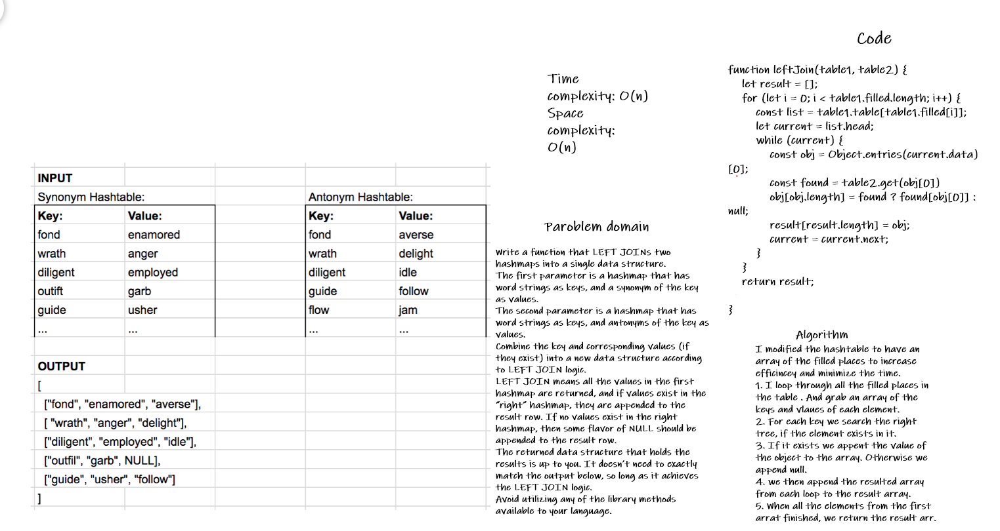

# Hashmap LEFT JOIN
<!-- Short summary or background information -->
Write a function that LEFT JOINs two hashmaps into a single data structure.

## Challenge
<!-- Description of the challenge -->
The first parameter is a hashmap that has word strings as keys, and a synonym of the key as values.
The second parameter is a hashmap that has word strings as keys, and antonyms of the key as values.
Combine the key and corresponding values (if they exist) into a new data structure according to LEFT JOIN logic.
LEFT JOIN means all the values in the first hashmap are returned, and if values exist in the “right” hashmap, they are appended to the result row. If no values exist in the right hashmap, then some flavor of NULL should be appended to the result row.
The returned data structure that holds the results is up to you. It doesn’t need to exactly match the output below, so long as it achieves the LEFT JOIN logic.
Avoid utilizing any of the library methods available to your language.

## Approach & Efficiency
<!-- What approach did you take? Why? What is the Big O space/time for this approach? -->
I modified the hashtable to have an array of the filled places to increase efficiency and minimize the time.

1. I loop through all the filled places in the table . And grab an array of the keys and values of each element.
2. For each key we search the right tree, if the element exists in it.
3. If it exists we append the value of the object to the array. Otherwise we append null.
4. we then append the resulted array from each loop to the result array.
5. When all the elements from the first array finished, we return the result arr.

## Analysis

Because we are looping through the first table only once, the time complexity will be: BigO (n).
Since we create an array that contains all element from one of the tables the space complexity will also be: BigO (n).

## Solution
<!-- Embedded whiteboard image -->

