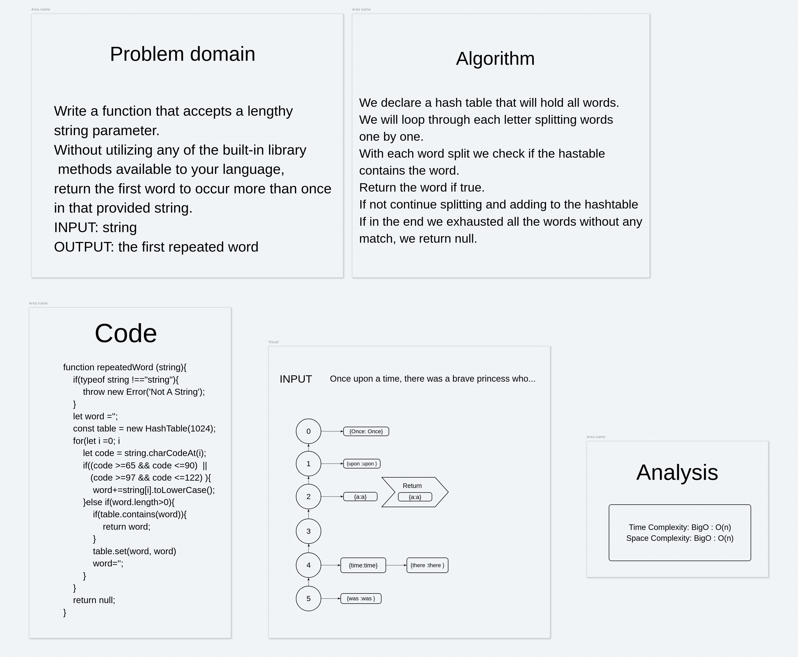

# Challenge Summary
<!-- Description of the challenge -->
Write a function that accepts a lengthy string parameter.
Without utilizing any of the built-in library methods available to your language, return the first word to occur more than once in that provided string.

## Whiteboard Process
<!-- Embedded whiteboard image -->

## Approach & Efficiency
<!-- What approach did you take? Why? What is the Big O space/time for this approach? -->
Time complexity = BigO => O(n). We loop through all string characters once so the time will be only O(n);
Space Complexity: Since we are using a hashtable to save words thee space is O(n);

## Solution
<!-- Show how to run your code, and examples of it in action -->
We declare a hash table that will hold all words.

We will loop through each letter splitting words

one by one.

With each word split we check if the hastable

contains the word.

Return the word if true.

If not continue splitting and adding to the hashtable

If in the end we exhausted all the words without any

match, we return null.
