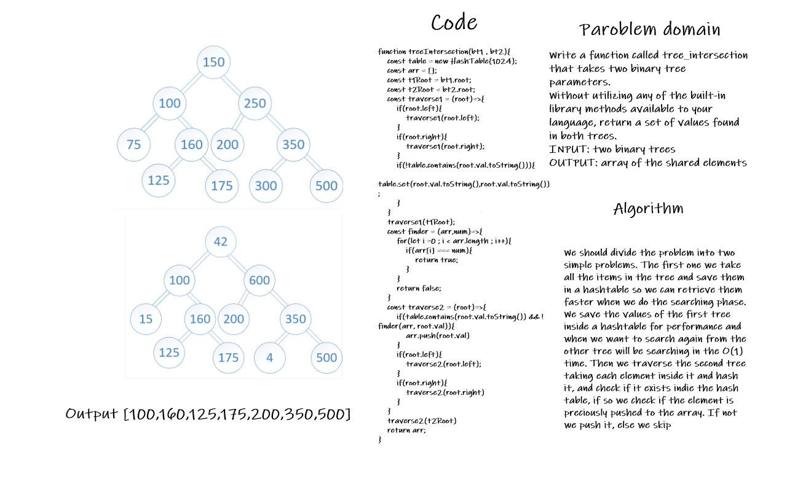

# Challenge Summary
<!-- Description of the challenge -->
Write a function called tree_intersection that takes two binary tree parameters.
Without utilizing any of the built-in library methods available to your language, return a set of values found in both trees.

## Whiteboard Process
<!-- Embedded whiteboard image -->

## Approach & Efficiency
<!-- What approach did you take? Why? What is the Big O space/time for this approach? -->
Because we are looping through each tree only once the time complexity will be:
Time Complexity: BigO = O(n)

Because we have a hashtable to save each node value, we save all the first tree values inside the hashtable so the space complexity:
Space Complexity: BigO = O(n)

## Solution
<!-- Show how to run your code, and examples of it in action -->
We should divide the problem into two simple problems. The first one we take all the items in the tree and save them in a hashtable so we can retrieve them faster when we do the searching phase. We save the values of the first tree inside a hashtable for performance and when we want to search again from the other tree will be searching in the O(1) time. Then we traverse the second tree taking each element inside it and hash it, and check if it exists indie the hash table, if so we check if the element is preciously pushed to the array. If not we push it, else we skip
