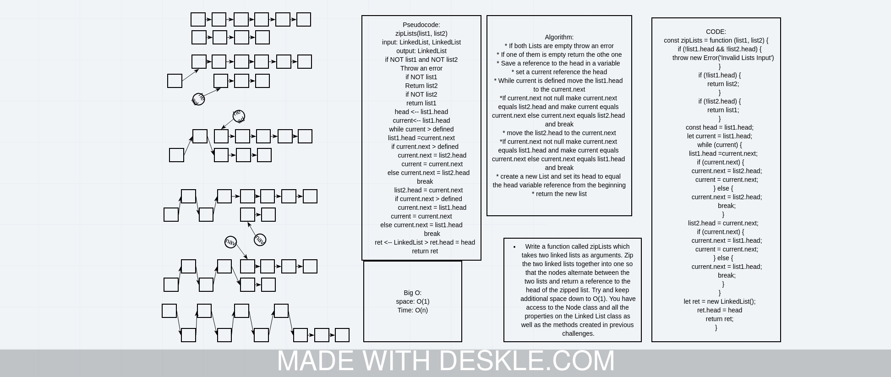

# Challenge Summary
<!-- Description of the challenge -->
Write a function called zipLists which takes two linked lists as arguments. Zip the two linked lists together into one so that the nodes alternate between the two lists and return a reference to the head of the zipped list. Try and keep additional space down to O(1). You have access to the Node class and all the properties on the Linked List class as well as the methods created in previous challenges.

## Whiteboard Process
<!-- Embedded whiteboard image -->

## Approach & Efficiency
<!-- What approach did you take? Why? What is the Big O space/time for this approach? -->

* If both Lists are empty throw an error

* If one of them is empty return the othe one

* Save a reference to the head in a variable

* set a current reference the head

* While current is defined move the list1.head to the current.next

*If current.next not null make current.next equals list2.head and make current equals current.next else current.next equals list2.head and break

* move the list2.head to the current.next

*If current.next not null make current.next equals list1.head and make current equals current.next else current.next equals list1.head and break

* create a new List and set its head to equal the head variable reference from the beginning

* return the new list
BigO:

* time: O(n);
* space: O(1)

## Solution
<!-- Show how to run your code, and examples of it in action -->
Example
zipLists(list1, list2)
| Arg list1                      | Arg list2                      | Output                                              |
| ------------------------------ | ------------------------------ | --------------------------------------------------- |
| head -> [1] -> [3] -> [2] -> X | head -> [5] -> [9] -> [4] -> X | head -> [1] -> [5] -> [3] -> [9] -> [2] -> [4] -> X |
| head -> [1] -> [3] -> X        | head -> [5] -> [9] -> [4] -> X | head -> [1] -> [5] -> [3] -> [9] -> [4] -> X        |
| head -> [1] -> [3] -> [2] -> X | head -> [5] -> [9] -> X        | head -> [1] -> [5] -> [3] -> [9] -> [2] -> X        |
