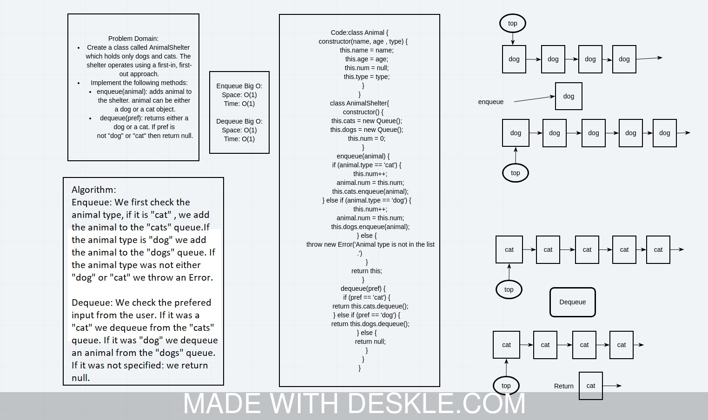

# Challenge Summary
<!-- Description of the challenge -->
Create a class called AnimalShelter which holds only dogs and cats. The shelter operates using a first-in, first-out approach.
Implement the following methods:
enqueue(animal): adds animal to the shelter. animal can be either a dog or a cat object.
dequeue(pref): returns either a dog or a cat. If pref is not "dog" or "cat" then return null.

## Whiteboard Process
<!-- Embedded whiteboard image -->


## Approach & Efficiency
<!-- What approach did you take? Why? What is the Big O space/time for this approach? -->
BigO :
enqueue =>

* Space = O(1).
* Time = O(1).
dequeue =>

* Space = O(1).
* Time = O(1).

## Solution
<!-- Show how to run your code, and examples of it in action -->
To run the code, first you need to require the modue and create a linked list object:

```javascript

const {AnimalShelter, Animal} = require("../animal-shelter.js")
const shlter = new AnimalShelter();

```

Next, you can enqueue new Animal node to the list using the `.enqueue(animal)` method:

```javascript

let animal1 = new Animal('lucy', 5, 'cat')
let animal2 = new Animal('ward', 1, 'dog')
let animal3 = new Animal('foo', 1, 'bar')

shelter.enqueue(animal1); // success
shelter.enqueue(animal2); // success
shelter.enqueue(animal3); // Error Anaimal is not able to be sheltered


```

Then you can dequeue the nodes from the last node in the queue

```javascript

shelter.dequeue('cat'); // return a cat node and dequeeue the cats list
shelter.dequeue('dog'); // retrun a dog node and dequeue the dogs lsit
shelter.dequeue('foo'); // reutrn null

```
