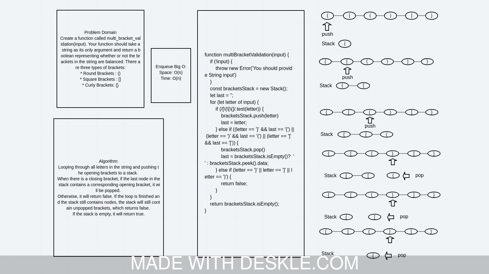

# Challenge Summary
<!-- Description of the challenge -->
Create a function called multi_bracket_validation(input). Your function should take a string as its only argument and return a boolean representing whether or not the brackets in the string are balanced. There are three types of brackets:

* Round Brackets : ()
* Square Brackets : []
* Curly Brackets: {}

## Whiteboard Process
<!-- Embedded whiteboard image -->


## Approach & Efficiency
<!-- What approach did you take? Why? What is the Big O space/time for this approach? -->
It is looping through all letters in the string and pushing the opening brackets to a stack. When there is a closing bracket, if the last node in the stack contains a corresponding opening bracket, it will be popped. Otherwise, it will return false. If the loop is finished and the stack still contains nodes, the stack will still contain unpopped brackets, which returns false. If the stack is empty, it will return true.

### Big(O):

* Time complexity: O(n).
* Space compexity: O(n).

## Solution
<!-- Show how to run your code and examples of it in action -->
First you need to import the module into your app:

```javascript

const {multiBracketValidation} = require('multi-bracket-validation.js');

```

The function takes arrays or string of charecters:

```javascript

multiBracketValidation('({}())'); // returns true
multiBracketValidation('{[(([]'); // returns false
multiBracketValidation(''); // throws an error
multiBracketValidation(5); // throws an error

```

## Examples

| Input                  | Output |
| ---------------------- | ------ |
| {}                     | TRUE   |
| {}(){}                 | TRUE   |
| ()[[Extra Characters]] | TRUE   |
| (){}[[]]               | TRUE   |
| {}{Code}[Fellows](())  | TRUE   |
| [({}]                  | FALSE  |
| (](                    | FALSE  |
| {(})                   | FALSE  |

| Input | Output | Why                                                    |
| ----- | ------ | ------------------------------------------------------ |
| {     | FALSE  | error unmatched opening { remaining.                   |
| )     | FALSE  | error closing ) arrived without corresponding opening. |
| [}    | FALSE  | error closing }. Doesn’t match opening (.              |
