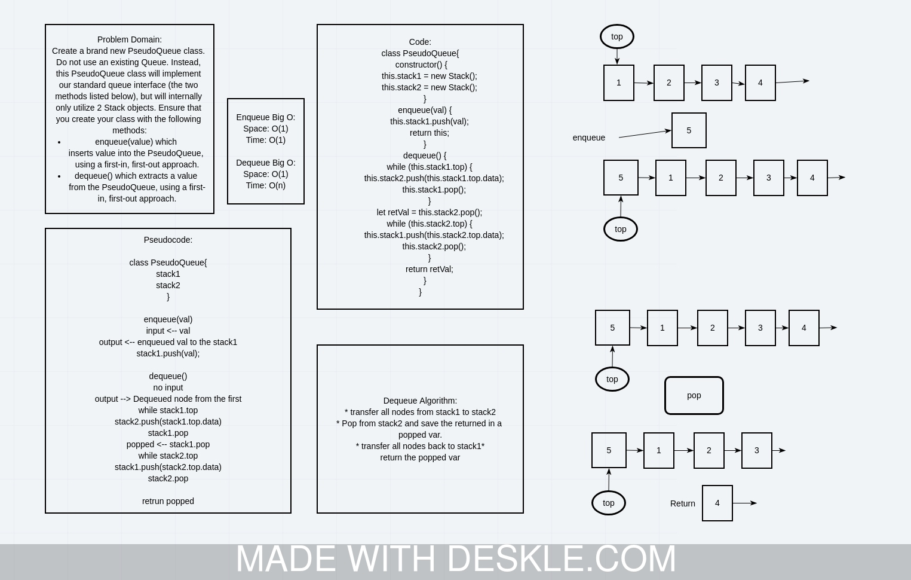

# Challenge Summary
<!-- Description of the challenge -->
Create a brand new PseudoQueue class. Do not use an existing Queue. Instead, this PseudoQueue class will implement our standard queue interface (the two methods listed below), but will internally only utilize 2 Stack objects. Ensure that you create your class with the following methods:

enqueue(value) which inserts value into the PseudoQueue, using a first-in, first-out approach.
dequeue() which extracts a value from the PseudoQueue, using a first-in, first-out approach.
The Stack instances have only push, pop, and peek methods. You should use your own Stack implementation. Instantiate these Stack objects in your PseudoQueue constructor.

## Whiteboard Process
<!-- Embedded whiteboard image -->


## Approach & Efficiency
<!-- What approach did you take? Why? What is the Big O space/time for this approach? -->
Dequeue:

* transfer all nodes from stack1 to stack2

* Pop from stack2 and save the returned in a popped var.

* transfer all nodes back to stack1*

return the popped var

BigO :
enqueue =>

* Space = O(1).
* Time = O(1).
dequeue =>

* Space = O(1).
* Time = O(n).

## Solution
<!-- Show how to run your code, and examples of it in action -->
To run the code, first you need to require the modue and create a linked list object:

```javascript

const PseudoQueue = require("../queue-with-stacks.js")
const sq = new PseudoQueue();

```

Next, you can enqueue new nodes to the list using the `.enqueue(val)` method:

```javascript

sq.enqueue(1);
sq.enqueue(2);


```

Then you can dequeue the nodes from the last node in the queue

```javascript

sq.dequeue();

```

If you log sq after ,you must see `{ 2 -> null}`.

## Example

enqueue(value)
| Input            | Args | Output                |
| ---------------- | ---- | --------------------- |
| [10]->[15]->[20] | 5    | [5]->[10]->[15]->[20] |
| ->null           | 5    | [5]                   |

dequeue()
| Input                 | Output | Internal State   |
| --------------------- | ------ | ---------------- |
| [5]->[10]->[15]->[20] | 20     | [5]->[10]->[15]) |
| [5]->[10]->[15]       | 15     | [5]->[10]        |
