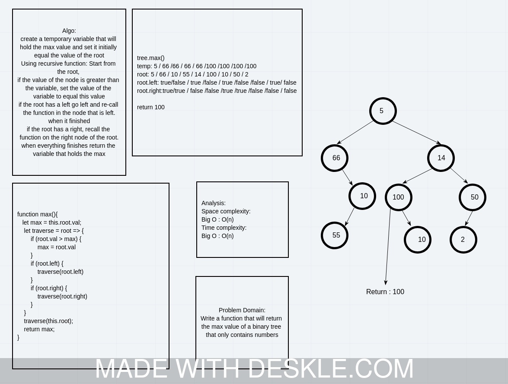

# Challenge Summary
<!-- Description of the challenge -->
Write a method on the Binary Tree class that will find the max number in the tree and return it.

## Whiteboard Process
<!-- Embedded whiteboard image -->


## Approach & Efficiency
<!-- What approach did you take? Why? What is the Big O space/time for this approach? -->
Using recursive function We can go through all nodes in the tree. If it is greater than the max temp variable we change it to the new max. Otherwise we look left and right. And we re-call the function on each left and right if exists.

Big O:

* Space: O(h).
* Time: O(n)

## Solution
<!-- Show how to run your code, and examples of it in action -->
Using the BinaryTree. Create a new instance of the class.

```javascript

let tree = new BinaryTree(5);

```

Insert some new nodes to the tree:

```javascript

tree.add(11).add(100).add(30)

```

Log the max value with this method:

```javascript

console.log(tree.max());

```

This should print "100" to the console.
