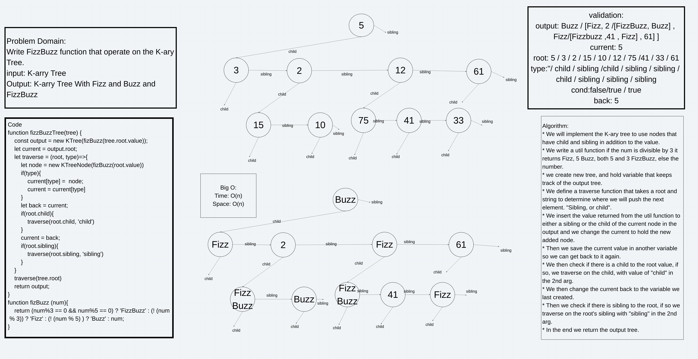

# Challenge Summary
<!-- Description of the challenge -->
Write FizzBuzz function that operate on the K-ary Tree.

input: K-arry Tree

Output: K-arry Tree With Fizz and Buzz and FizzBuzz

## Whiteboard Process
<!-- Embedded whiteboard image -->


## Approach & Efficiency
<!-- What approach did you take? Why? What is the Big O space/time for this approach? -->
1. We will implement the K-ary tree to use nodes that have child and sibling in addition to the value.
2. We write a util function if the num is divisible by 3 it returns Fizz, 5 Buzz, both 5 and 3 FizzBuzz, else the number.
3. we create new tree, and hold variable that keeps track of the output tree.
4. We define a traverse function that takes a root and string to determine where we will push the next element. "Sibling, or child".
5. We insert the value returned from the util function to either a sibling or the child of the current node in the output and we change the current to hold the new added node.
6. Then we save the current value in another variable so we can get back to it again.
7. We then check if there is a child to the root value, if so, we traverse on the child, with value of "child" in the 2nd arg.
8. We then change the current back to the variable we last created.
9. Then we check if there is sibling to the root, if so we traverse on the root's sibling with "sibling" in the 2nd arg.
10. In the end we return the output tree.

Big O:

* Time: O(n)
* Space: O(n)

## Solution
<!-- Show how to run your code, and examples of it in action -->
First: you need to require the module

```javascript

const {fizzBuzzTree} = require('fizz-buzz-tree');

```

Then, you need to have a k-ary tree or to create one. So, we also need to require the tree modules of the KTree and KtreeNode.

```javascript

const {
    KTree,
    KTreeNode
} = require('../../tree');

let tree = new KTree(5);
tree.root.child = new KTreeNode(3);

```

Now, you can apply the function on the tree:

```javascript

let FBTree = fizzBuzzTree(tree);
console.log(FBTree)

```

If you did all the steps the console should print:
`KTree{
    root: {value:"Buzz",
           sibling:null,
           child:{
            value:"Fizz",
            sibling:null,
            child:null
           }}
}`
